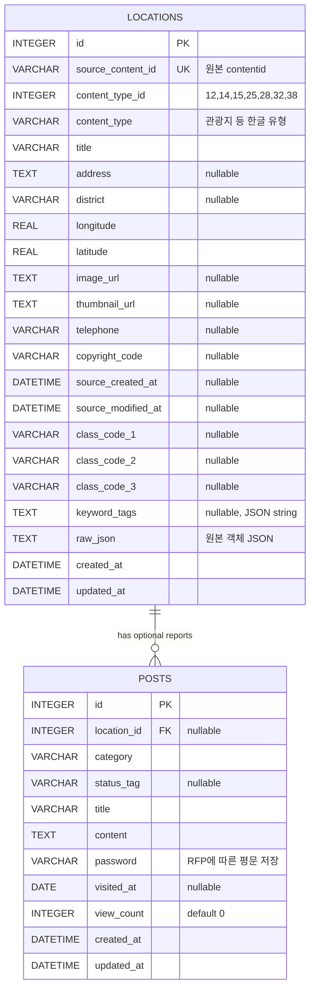
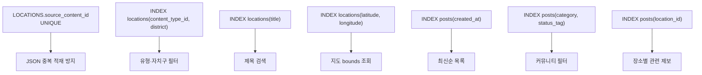
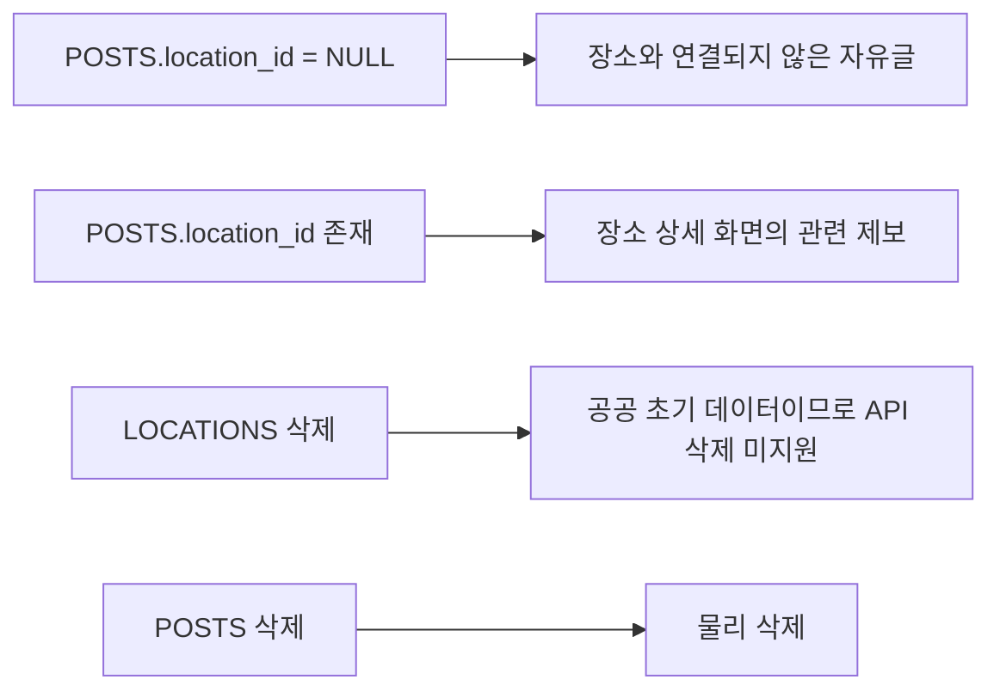
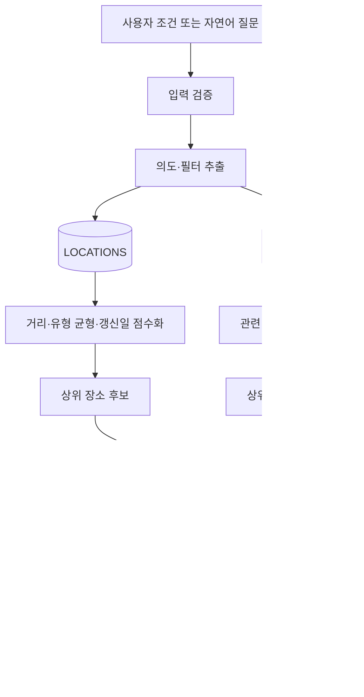
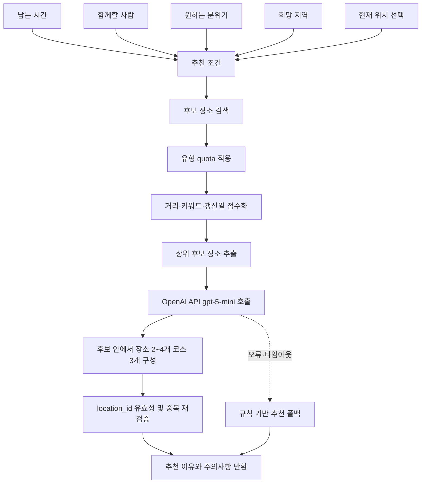
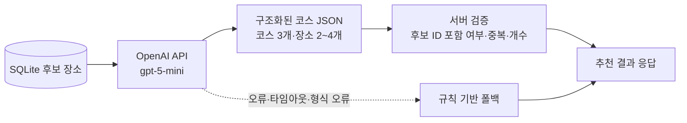

# 틈서울(TeumSeoul) ERD

```mermaid
erDiagram
    LOCATIONS ||--o{ POSTS : "has optional reports"

    LOCATIONS {
        INTEGER id PK
        VARCHAR source_content_id UK "원본 contentid"
        INTEGER content_type_id "12,14,15,25,28,32,38"
        VARCHAR content_type "관광지 등 한글 유형"
        VARCHAR title
        TEXT address "nullable"
        VARCHAR district "nullable"
        REAL longitude
        REAL latitude
        TEXT image_url "nullable"
        TEXT thumbnail_url "nullable"
        VARCHAR telephone "nullable"
        VARCHAR copyright_code "nullable"
        DATETIME source_created_at "nullable"
        DATETIME source_modified_at "nullable"
        VARCHAR class_code_1 "nullable"
        VARCHAR class_code_2 "nullable"
        VARCHAR class_code_3 "nullable"
        TEXT keyword_tags "nullable, JSON string"
        TEXT raw_json "원본 객체 JSON"
        DATETIME created_at
        DATETIME updated_at
    }

    POSTS {
        INTEGER id PK
        INTEGER location_id FK "nullable"
        VARCHAR category
        VARCHAR status_tag "nullable"
        VARCHAR title
        TEXT content
        VARCHAR password "RFP에 따른 평문 저장"
        DATE visited_at "nullable"
        INTEGER view_count "default 0"
        DATETIME created_at
        DATETIME updated_at
    }
```

## 인덱스 및 제약조건

```mermaid
flowchart TB
    A["LOCATIONS.source_content_id<br/>UNIQUE"] --> B["JSON 중복 적재 방지"]
    C["INDEX locations(content_type_id, district)"] --> D["유형·자치구 필터"]
    E["INDEX locations(title)"] --> F["제목 검색"]
    G["INDEX locations(latitude, longitude)"] --> H["지도 bounds 조회"]
    I["INDEX posts(created_at)"] --> J["최신순 목록"]
    K["INDEX posts(category, status_tag)"] --> L["커뮤니티 필터"]
    M["INDEX posts(location_id)"] --> N["장소별 관련 제보"]
```

## 관계 규칙

```mermaid
flowchart LR
    P["POSTS.location_id = NULL"] --> Q["장소와 연결되지 않은 자유글"]
    R["POSTS.location_id 존재"] --> S["장소 상세 화면의 관련 제보"]
    T["LOCATIONS 삭제"] --> U["공공 초기 데이터이므로 API 삭제 미지원"]
    V["POSTS 삭제"] --> W["물리 삭제"]
```

## 추천·챗봇 데이터 흐름

```mermaid
flowchart TD
    U[사용자 조건 또는 자연어 질문] --> V[입력 검증]
    V --> W[의도·필터 추출]
    W --> X[(LOCATIONS)]
    W --> Y[(POSTS)]
    X --> Z[거리·유형 균형·갱신일 점수화]
    Y --> AA[관련 현장 제보 선별]
    Z --> AB[상위 장소 후보]
    AA --> AC[상위 게시글 후보]
    AB --> AD[OpenAI gpt-5-mini 요약]
    AC --> AD
    AD --> AE[answer + results + community_posts + warnings]
    AD -. "장애/타임아웃" .-> AF[검색 결과 템플릿 폴백]
    AF --> AE
```

## 상황형 추천 흐름

```mermaid
flowchart TD
    A1[남는 시간] --> R1[추천 조건]
    A2[함께할 사람] --> R1
    A3[원하는 분위기] --> R1
    A4[희망 지역] --> R1
    A5[현재 위치 선택] --> R1

    R1 --> C1[후보 장소 검색]
    C1 --> C2[유형 quota 적용]
    C2 --> C3[거리·키워드·갱신일 점수화]
    C3 --> C4[상위 후보 장소 추출]
    C4 --> C5[OpenAI API gpt-5-mini 호출]
    C5 --> C6[후보 안에서 장소 2~4개 코스 3개 구성]
    C6 --> C7[location_id 유효성 및 중복 재검증]
    C7 --> C8[추천 이유와 주의사항 반환]
    C5 -. 오류·타임아웃 .-> C9[규칙 기반 추천 폴백]
    C9 --> C8
```

## 상황형 추천 모델 제약

```mermaid
flowchart LR
    DB[(SQLite 후보 장소)] --> GPT["OpenAI API<br/>gpt-5-mini"]
    GPT --> JSON["구조화된 코스 JSON<br/>코스 3개·장소 2~4개"]
    JSON --> VALIDATE["서버 검증<br/>후보 ID 포함 여부·중복·개수"]
    VALIDATE --> RESPONSE["추천 결과 응답"]
    GPT -. "오류·타임아웃·형식 오류" .-> FALLBACK["규칙 기반 폴백"]
    FALLBACK --> RESPONSE
```
